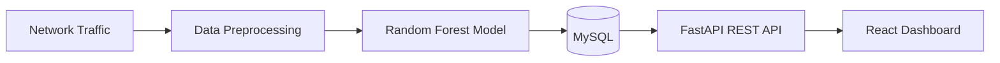
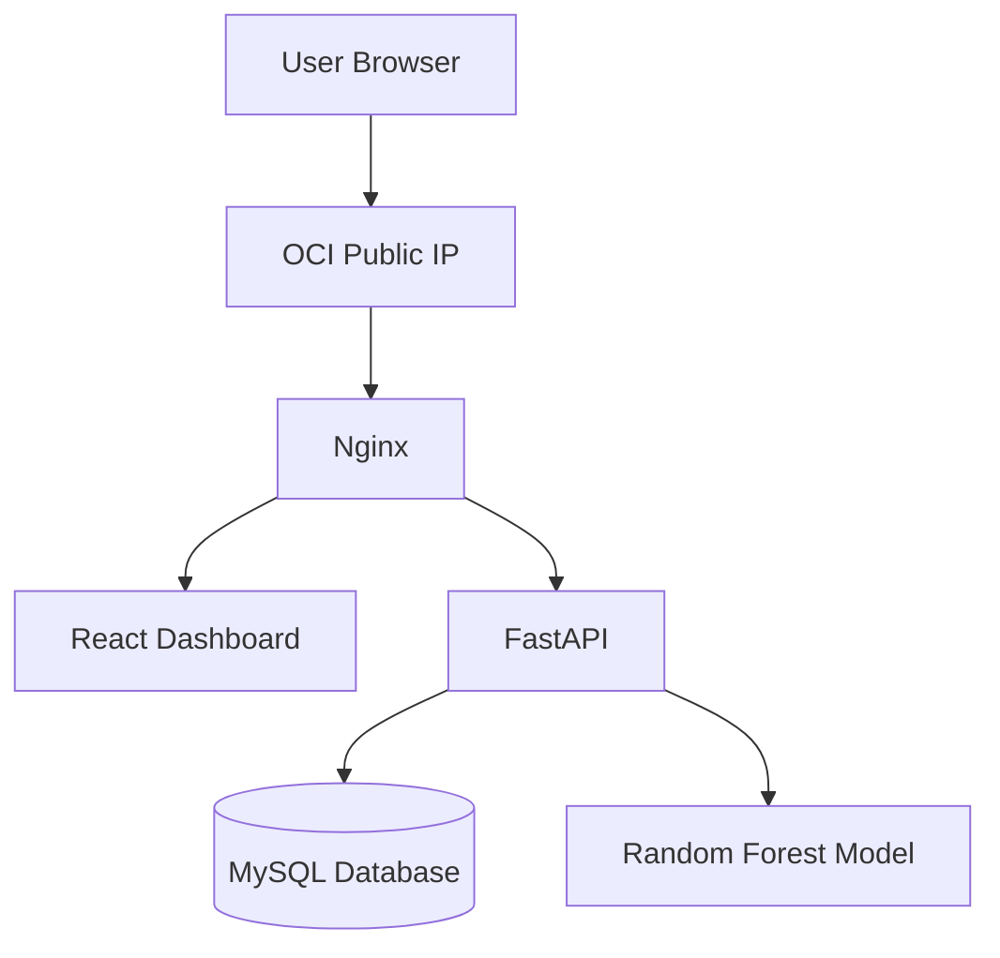
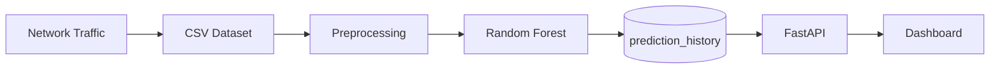

# 🛡️ NETGUARD IDS

> AI 기반 실시간 네트워크 침입 탐지 시스템 (Intrusion Detection System)


---

# 📌 프로젝트 소개

NETGUARD IDS는 머신러닝(Random Forest)을 이용하여 네트워크 트래픽을 분석하고 공격 여부를 실시간으로 탐지하는 AI 기반 침입 탐지 시스템입니다.

기존 IDS는 로그 중심으로 동작하여 현재 네트워크 상태를 직관적으로 파악하기 어렵습니다.

본 프로젝트는 머신러닝 분석 결과를 Dashboard 형태로 시각화하여

- 공격 발생 현황
- 공격 비율
- 위험도
- 공격 유형
- 최근 탐지 로그

를 한 화면에서 확인할 수 있도록 구현하였습니다.

---

# 🎯 주요 기능

- ✅ 실시간 네트워크 트래픽 분석
- ✅ Random Forest 기반 공격 탐지
- ✅ 공격 유형 분류
- ✅ 위험도(Risk Score) 계산
- ✅ FastAPI REST API 제공
- ✅ React Dashboard 시각화
- ✅ 최근 공격 로그 조회
- ✅ MySQL 데이터 저장

---

# 🖥️ 서비스 사용 시나리오

1. 네트워크 트래픽 수집
2. 데이터 전처리
3. Random Forest 모델 예측
4. 결과 DB 저장
5. FastAPI API 제공
6. React Dashboard 실시간 시각화

---

# 🏗️ 전체 아키텍처



---

# ☁️ Oracle Cloud Infrastructure (OCI)



---

# ☁️ 사용한 OCI 리소스

| OCI Resource | 설명 |
|--------------|------------------------------|
| Compute Instance | Oracle Linux 서버 |
| Virtual Cloud Network | 네트워크 |
| Internet Gateway | 외부 접속 |
| Public IP | 서비스 공개 |
| Security List | 포트 허용 |
| Oracle Linux 8 | 운영체제 |

---

# ⚙️ 기술 스택

| 분야 | 기술 |
|------|------|
| Backend | FastAPI |
| Frontend | React |
| Database | MySQL |
| AI | Random Forest (Scikit-learn) |
| Web Server | Nginx |
| Cloud | Oracle Cloud Infrastructure |
| OS | Oracle Linux 8 |

---

# 📂 프로젝트 구조

```text
ids_project

├── backend
│   ├── api
│   ├── database
│   ├── services
│   └── model
│
├── frontend
│   ├── src
│   │   ├── components
│   │   ├── pages
│   │   ├── charts
│   │   └── assets
│   └── public
│
├── dataset
│
├── nginx
│
└── README.md
```

---

# 🚀 설치 방법

## 1. Clone

```bash
git clone https://github.com/USERNAME/NETGUARD_IDS.git

cd ids_project
```

---

## 2. Python

```bash
python -m venv venv

source venv/bin/activate
```

---

## 3. 패키지 설치

```bash
pip install -r requirements.txt
```

---

## 4. FastAPI 실행

```bash
uvicorn main:app --host 0.0.0.0 --port 8000
```

---

## 5. Frontend

```bash
cd frontend

npm install

npm run dev
```

배포

```bash
npm run build

sudo cp -r dist/* /var/www/ids/

sudo systemctl restart nginx
```

---

# 🔄 데이터 흐름



---

# 📊 데이터 흐름 상세 설명

## ① 수집(Source)

- 네트워크 트래픽
- UNSW-NB15 Dataset

↓

## ② 저장(Storage)

MySQL

- prediction_history
- notification_log

↓

## ③ 가공(Processing)

- 데이터 전처리
- Random Forest 예측
- Attack / Normal 분류
- Confidence 계산
- Risk Score 계산

↓

## ④ 제공(Service)

FastAPI REST API

↓

React Dashboard

---

# 📡 API

| Method | URL |
|---------|----------------|
| GET | /dashboard |
| GET | /logs |
| GET | /recent-attacks |
| GET | /system |
| GET | /model |

---

# 📈 Dashboard

Dashboard에서는 다음 정보를 실시간으로 제공합니다.

- 총 분석 트래픽
- 공격 탐지 수
- 정상 트래픽
- 공격 비율
- 시스템 위험도
- 공격 추이
- 공격 유형별 통계
- 최근 공격 알림

---

# ⚠️ 한계점

현재 프로젝트는 다음과 같은 한계가 있습니다.

- CSV 기반 데이터 사용
- 단일 Random Forest 모델
- 단일 서버 환경
- WebSocket 미적용
- 사용자 인증 미지원
- 실시간 Packet Capture 미구현

---

# 🚀 향후 개선 방향

- 실시간 Packet Capture 적용 (Scapy)
- Kafka 기반 Streaming
- Redis Cache
- Docker Containerization
- Kubernetes 배포
- JWT 로그인
- WebSocket 실시간 업데이트
- LSTM 기반 AI 모델 적용
- 이메일 및 Slack 알림
- Elasticsearch + Kibana 연동

---

# 👨‍💻 개발 환경

- Oracle Cloud Infrastructure
- Oracle Linux 8
- Python 3.11
- Node.js
- React
- FastAPI
- MySQL 8
- Nginx

---

# 📄 License

This project was developed for educational purposes.