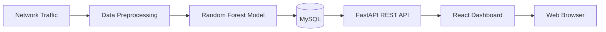
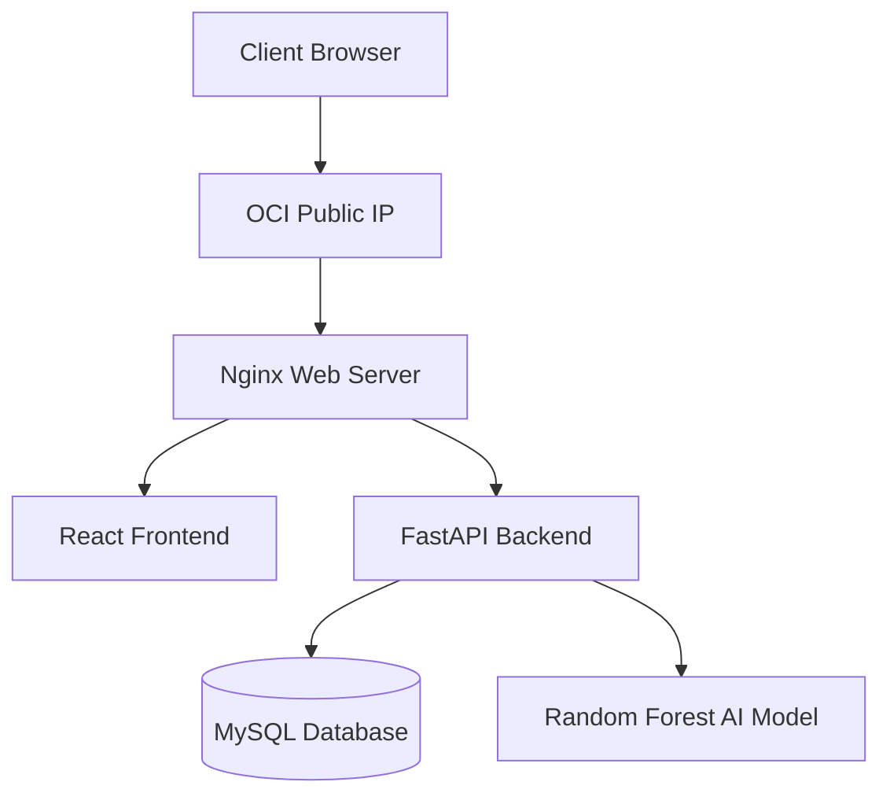
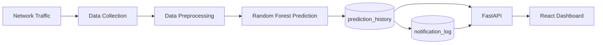

# 🛡️ NETGUARD IDS
### AI-Based Network Intrusion Detection System on Oracle Cloud Infrastructure

NETGUARD IDS는 Oracle Cloud Infrastructure(OCI) 환경에서 구축한 AI 기반 네트워크 침입 탐지 시스템입니다.

네트워크 트래픽을 수집하고 머신러닝(Random Forest) 모델을 이용하여 공격 여부를 탐지한 뒤, FastAPI를 통해 REST API를 제공하고 React Dashboard에서 실시간으로 시각화합니다.

---

# 📌 서비스 소개

기존의 IDS(Intrusion Detection System)는 로그 위주의 결과를 제공하기 때문에 현재 네트워크 상황을 한눈에 파악하기 어렵습니다.

NETGUARD IDS는 이러한 문제를 해결하기 위해 머신러닝 기반 침입 탐지 기술과 실시간 Dashboard를 결합하여 네트워크 보안 상태를 직관적으로 확인할 수 있도록 설계되었습니다.

사용자는 웹 브라우저를 통해

- 현재 공격 비율
- 시스템 위험도
- 공격 유형 통계
- 시간대별 공격 추이
- 최근 탐지된 공격 로그
- 모델 정보

를 실시간으로 확인할 수 있습니다.

---

# 🎯 주요 기능

- AI(Random Forest) 기반 공격 탐지
- 실시간 공격 로그 저장
- 공격 유형 분류
- Dashboard 실시간 시각화
- 공격 비율 및 위험도 계산
- FastAPI REST API 제공
- MySQL 기반 데이터 관리
- Oracle Cloud Infrastructure 배포

---

# 🖥️ 서비스 사용 시나리오

1. 네트워크 트래픽이 시스템으로 유입됩니다.

2. 전처리 모듈이 모델 입력 형식으로 데이터를 변환합니다.

3. Random Forest 모델이 공격 여부와 공격 유형을 예측합니다.

4. 예측 결과를 MySQL에 저장합니다.

5. FastAPI가 Dashboard에 필요한 데이터를 제공합니다.

6. React Dashboard가 실시간 통계 및 로그를 시각화합니다.

---

# 🏗️ 전체 시스템 아키텍처



---

# ☁ Oracle Cloud Infrastructure 아키텍처



---

# ☁ 사용한 OCI 리소스

| OCI Resource | 용도 |
|--------------|------------------------------|
| Compute Instance | Oracle Linux 서버 |
| Virtual Cloud Network | 네트워크 구성 |
| Internet Gateway | 외부 인터넷 연결 |
| Public IP | 웹 서비스 공개 |
| Security List | HTTP / SSH 포트 허용 |
| Oracle Linux 8 | 운영체제 |

---

# 🛠 기술 스택

## Backend

- Python
- FastAPI
- Uvicorn

## AI

- Scikit-learn
- Random Forest
- Pandas
- NumPy

## Database

- MySQL
- mysql-connector-python

## Frontend

- React
- Vite
- Axios
- Recharts

## Server

- Oracle Linux 8
- Nginx
- OCI Compute Instance

---

# 📂 프로젝트 구조

```text
ids_project
│
├── backend
│   ├── api
│   ├── database
│   ├── service
│   ├── model
│   └── main.py
│
├── frontend
│   ├── src
│   ├── public
│   └── dist
│
├── dataset
│
├── models
│
├── requirements.txt
│
└── README.md
```

---

# 🚀 설치 방법

## 설치

### 1. 프로젝트 Clone

git clone ...

### 2. Python Virtual Environment

python3 -m venv venv

source venv/bin/activate

### 3. Dependency Installation

pip install -r requirements.txt

### 4. Frontend Installation

npm install

---

## 실행

### Backend

sudo systemctl start ids

### Frontend

npm run build

sudo cp -r dist/* /var/www/ids/

### Nginx

sudo systemctl restart nginx

---

## Frontend 실행

개발 환경

```bash
npm run dev
```

배포 환경

```bash
npm run build

sudo cp -r dist/* /var/www/ids/

sudo systemctl restart nginx
```

---

## Nginx 실행

```bash
sudo systemctl restart nginx
```

상태 확인

```bash
sudo systemctl status nginx
```

---

# 🌐 서비스 접속

| 서비스 | URL |
|----------|---------------------------|
| Dashboard | http://132.226.226.175/ |
| Swagger | http://132.226.226.175/docs |
| Dashboard API | http://132.226.226.175/api/dashboard |

---

# 🔄 데이터 흐름



---

# 📊 데이터 흐름 상세 설명

## ① 수집(Source)

네트워크 트래픽 또는 CSV 형태의 패킷 데이터를 수집합니다.

↓

## ② 저장(Storage)

예측 결과와 공격 정보를 MySQL에 저장합니다.

사용 테이블

- prediction_history
- notification_log

↓

## ③ 가공(Processing)

수집된 데이터를 전처리한 후 Random Forest 모델이 다음 정보를 생성합니다.

- Attack / Normal 분류
- 공격 유형
- Confidence Score
- Risk Score 계산

↓

## ④ 제공(Service)

FastAPI가 REST API 형태로 데이터를 제공합니다.

↓

React Dashboard가 데이터를 시각화하여 사용자에게 제공합니다.

---

# 📊 Dashboard 구성

Dashboard에서는 다음 정보를 제공합니다.

- 전체 분석 건수
- 정상 트래픽 수
- 공격 탐지 수
- 공격 비율
- 시스템 위험도
- 시간대별 공격 추이
- 공격 유형 통계
- 최근 탐지 로그
- 최근 알림
- AI 모델 정보

---

# 📡 API

| Method | Endpoint |
|----------|----------------------|
| GET | /dashboard |
| GET | /logs |
| GET | /recent-attacks |
| GET | /system |
| GET | /model |

---

# ⚠ 한계점

현재 프로젝트는 다음과 같은 제한 사항이 있습니다.

- CSV 기반 데이터 사용
- Random Forest 단일 모델
- 단일 서버 환경
- WebSocket 미적용
- 사용자 인증 기능 미구현
- 실시간 Packet Capture 미적용
- 수평 확장(Scale-Out) 미지원

---

# 🚀 향후 개선 방향

- 실시간 Packet Capture(Scapy) 적용
- Kafka 기반 Streaming Pipeline 구축
- Redis Cache 적용
- Docker 컨테이너화
- Kubernetes 기반 서비스 배포
- JWT 사용자 인증
- WebSocket 실시간 Dashboard
- LSTM 및 XGBoost 모델 비교 적용
- 이메일 및 Slack 알림 기능
- Elasticsearch + Kibana 로그 분석
- OCI Load Balancer를 통한 이중화

---

# 💻 개발 환경

| 항목 | 내용 |
|------|---------------------------|
| Cloud | Oracle Cloud Infrastructure |
| OS | Oracle Linux 8 |
| Backend | FastAPI |
| Frontend | React + Vite |
| AI | Random Forest |
| Database | MySQL 8 |
| Web Server | Nginx |
| Language | Python 3.11 |

---

# 📄 License

본 프로젝트는 교육 및 학습 목적으로 개발되었습니다.